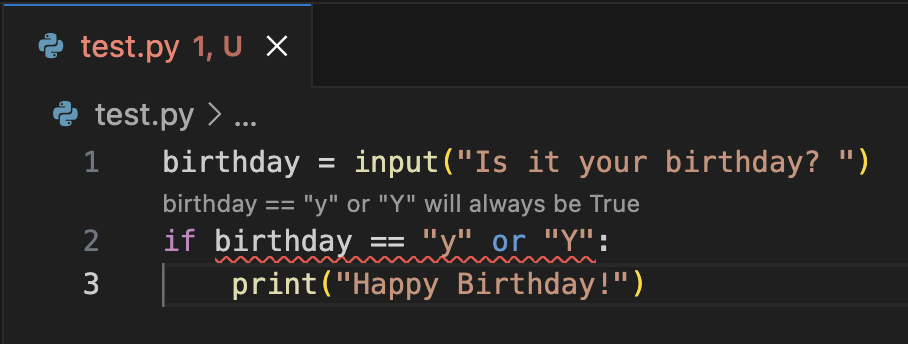
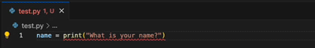
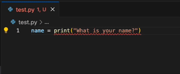
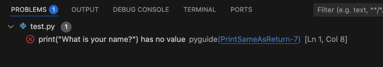

# PyGuide Extension for Visual Studio Code

Provides additional Python diagnostic messages aimed at beginners.

The extension was created by researchers at the University of York. Usage data collection is enabled by default to help us improve the extension. You can disable data collection at any time in Settings. Search for PyGuide then untick the box next to "Allow a University of York research project to collect usage data". [Read about the project and the data we collect on our website](https://supportive-ide.hosted.york.ac.uk/participate.html). Data collection is anonymous. 

## Features

PyGuide detects code issues that may indicate a misunderstanding of a concept or syntax, or a simple typo. Detected issues are underlined, just like other issues picked up by VSCode. By default, some quick feedback is displayed over underlined code. Click the message to open more detailed guidance.

If the "showCodeLens" setting is disabled, hover over underlined code to get some quick feedback.

Click the action in the lightbulb menu to open more detailed guidance.

You can also view detected issues in the Problems tab of your Terminal.

## Requirements

PyGuide requires the [Microsoft Python for VS Code](https://marketplace.visualstudio.com/items?itemName=ms-python.python) extension. It will automatically be installed if you do not already have it.

## Extension Settings

This extension contributes the following setting:

* `pyguide.allowLogging`: Disable/enable usage data collection for this extension only. 
* `pyguide.showCodeLens`: Show/hide a clickable feedback message above an issue in your code. If enabled, you can click the message to see extended feedback. If disabled, you can still access the extended feedback via the lightbulb menu or the Problems pane.

## Known Issues

This extension can only detect issues that are task independent—it cannot detect logic errors or strategic errors that would require knowledge of what you are working on. It is intended for beginner programmers so may not work with more advanced concepts and syntax.

## Release Notes

### 0.2.0
The extension now collects usage data by default unless you disable it in Settings. [Read about the research project and the data we collect on our website](https://supportive-ide.hosted.york.ac.uk/participate.html)

### 0.1.0
First release via the extension marketplace.

### 0.0.5
Minor bug fixes.

### 0.0.4
Added CodeLens to enable easier feedback access.

### 0.0.2 and 0.0.3
Fixed bugs relating to false detection of issues when using advanced Python concepts.

### 0.0.1
Initial release of PyGuide.

