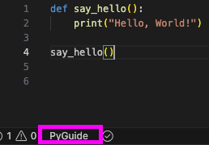
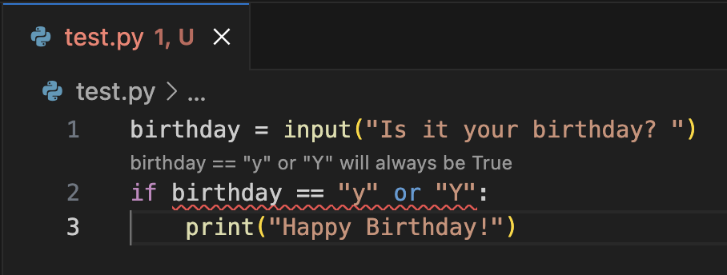
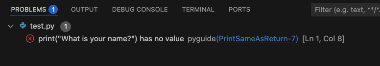

# PyGuide Extension for Visual Studio Code

Provides additional Python diagnostic messages aimed at beginners—-coders who are still getting comfortable with Python basics like boolean expressions and loops. 

The extension was created by researchers at the University of York. Usage data collection is enabled by default to help us improve the extension. You can disable data collection at any time in Settings. Search for PyGuide then untick the box next to "Allow a University of York research project to collect usage data". [Read about the project and the data we collect on our website](https://supportive-ide.hosted.york.ac.uk/participate.html). Data collection is anonymous. 

## Features

PyGuide detects code issues that may indicate a misunderstanding of a concept or syntax, or a simple typo. To check for issues, click the PyGuide button in the status bar.

Detected issues will be underlined, just like other issues picked up by VSCode. Some quick feedback is displayed over underlined code. Click the message to open more detailed guidance. 

After clicking the PyGuide button, you can also view detected issues in the Problems tab of your Terminal.

Note: all feedback will disappear if the file is edited or you switch to a different editor.

### Enable "live" feedback

By default, PyGuide feedback will only be shown when you click the button to request it. You can enable live feedback—-detected issues will be highlighted as you type--by going to settings, searching for "PyGuide", and enabling "Show Code Lens".

## Requirements

PyGuide requires the [Microsoft Python for VS Code](https://marketplace.visualstudio.com/items?itemName=ms-python.python) extension. It will automatically be installed if you do not already have it.

## Extension Settings

This extension contributes the following settings:

* `pyguide.allowLogging`: Disable/enable usage data collection for this extension only. 
* `pyguide.showCodeLens`: Enable / disable live issue detection. If disabled, you can manually check for issues by pressing the PyGuide button in the status bar.

## Known Issues

This extension can only detect issues that are task independent—it cannot detect logic errors or strategic errors that would require knowledge of what you are working on. It is intended for beginner programmers so may not work with more advanced concepts and syntax.

## Release Notes

### 0.5.1
Fixed a user-reported bug relating to use of named parameters inside function or method calls inside of a boolean expression.

### 0.5.0
Major change to feedback presentation. By default, feedback is no longer provided in real-time as you type. Instead, press the PyGuide button to check for issues. If you prefer real-time feedback, you can enable it via the settings described above.

### 0.4.0
Improved logging to prevent the extension from slowing with extended use.

### 0.3.1 and 0.3.2
Fixed a bug where code lens messages remained in the editor when switching tabs or closing a file.

### 0.3.0
Fixes a bug where valid use of the walrus operator was identified as a possible misconception. 

The extension also now collects data on usage of specific concepts (e.g. writing a valid assignment status). This will enable the researchers to determine if providing feedback on specific misconceptions helps users to correct the underlying issue.

### 0.2.0
The extension now collects usage data by default unless you disable it in Settings. [Read about the research project and the data we collect on our website](https://supportive-ide.hosted.york.ac.uk/participate.html)

### 0.1.0
First release via the extension marketplace.

### 0.0.5
Minor bug fixes.

### 0.0.4
Added CodeLens to enable easier feedback access.

### 0.0.2 and 0.0.3
Fixed bugs relating to false detection of issues when using advanced Python concepts.

### 0.0.1
Initial release of PyGuide.

